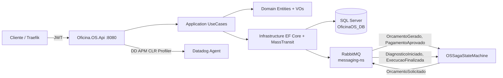
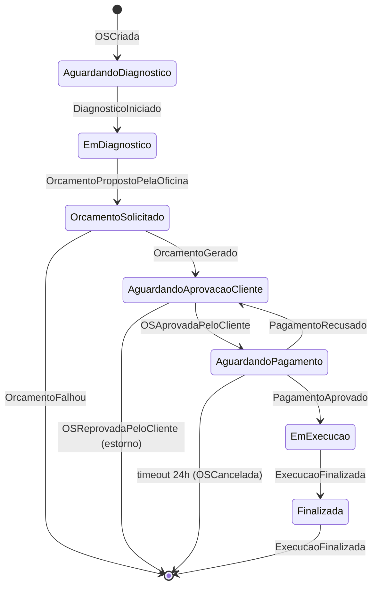

# oficinafiap-os-service — OS Service (orquestrador do Saga)

> Microsserviço de **Ordens de Serviço** do sistema **Oficina FIAP** — Fase 4 do Tech Challenge. Dono dos cadastros (Cliente, Veículo, Peça, Serviço) e da OS, e **orquestrador da Saga distribuída** com Billing Service e Execução Service.

---

## Por que este serviço é o orquestrador?

A Saga é **orquestrada** (decisão tomada e justificada em ADR). O OS Service hospeda:
- A `OSSagaStateMachine` (MassTransit + Automatonymous)
- A tabela `SagasOS` persistindo o estado de cada Saga (1:1 com OrdemDeServico)
- O scheduler de timeouts (24h sem pagamento → `OSCancelada`)

Os outros micros (Billing, Execução) **publicam** eventos de domínio sem conhecer o fluxo global — quem decide a próxima transição é a state machine aqui.

---

## Arquitetura





---

## Tecnologias

| Tecnologia | Versão | Uso |
|---|---|---|
| .NET / ASP.NET Core | 8.0 | Framework da API |
| Entity Framework Core | 8.0 | ORM + migrations |
| SQL Server (AWS RDS) | 2022 | Banco transacional (entidades + saga state + outbox) |
| MassTransit | 8.3 | Orquestrador da Saga + abstração de RabbitMQ |
| RabbitMQ | 3.13 (chart Bitnami 14.x) | Broker AMQP (no namespace `messaging-ns`) |
| Datadog APM | 3.3.1 CLR Profiler | Tracing distribuído + métricas + logs correlacionados |
| Serilog | 8.0 | Logs JSON estruturados |
| Traefik | v3 | API Gateway (rotas `/api/...` e `/health`) |
| GitHub Actions | — | CI/CD (build → testes → SonarCloud → GHCR → deploy) |
| SonarCloud | — | Quality gate (cobertura ≥ 80%, code smells, vulnerabilities) |
| xUnit + FluentAssertions + Moq | — | Testes unitários |
| Reqnroll | 2.1 | BDD (Specflow sucessor) — fluxo end-to-end da OS |

---

## Estrutura

```
oficinafiap-os-service/
├── Oficina.OS.Api/                  Controllers + Program.cs + Middlewares + appsettings
├── Oficina.OS.Application/          UseCases + DTOs + Events (contratos) + Sagas (state machine)
├── Oficina.OS.Domain/               Entities + ValueObjects (CPF, Placa) + Enums + Repositories interfaces
├── Oficina.OS.Infrastructure/       EF Core (DbContext + Configurations + Converters) + Repos + MassTransit setup
├── Oficina.OS.Domain.UnitTests/
├── Oficina.OS.Application.UnitTests/
├── Oficina.OS.Api.IntegrationTests/ + Reqnroll BDD specs
├── k8s/                             Deployment + Service + HPA + IngressRoute + ConfigMap + secrets.example
├── .github/workflows/ci-cd.yml      Build → Testes → SonarCloud → Docker push → Deploy K8s
├── Dockerfile                       Multi-stage com testes + Datadog CLR Profiler
└── oficinafiap-os-service.sln
```

---

## Endpoints REST

JWT Bearer obrigatório (exceto `GET /api/ordemdeservico/{id}` e `/health`).

| Método | Rota | Descrição |
|---|---|---|
| `POST` | `/api/clientes` | Cadastrar cliente |
| `GET` | `/api/clientes/{id}` | Obter por ID |
| `GET` | `/api/clientes/cpf/{cpf}` | Obter por CPF |
| `PUT` | `/api/clientes/{id}` | Atualizar |
| `POST` | `/api/veiculos` | Cadastrar veículo |
| `GET` | `/api/veiculos/placa/{placa}` | Obter por placa |
| `GET` | `/api/veiculos/cliente/{id}` | Listar por cliente |
| `POST` | `/api/catalogo/pecas` | Cadastrar peça |
| `GET` | `/api/catalogo/pecas` | Listar peças |
| `PUT` | `/api/catalogo/pecas/{id}` | Atualizar peça |
| `PATCH` | `/api/catalogo/pecas/{id}/estoque` | Ajustar estoque (+/-) |
| `POST` | `/api/catalogo/servicos` | Cadastrar serviço |
| `GET` | `/api/catalogo/servicos` | Listar serviços |
| `POST` | `/api/ordemdeservico` | **Abrir OS** (inicia Saga, publica `OSCriada`) |
| `GET` | `/api/ordemdeservico/{id}` | Consultar OS (público) |
| `GET` | `/api/ordemdeservico/painel` | Painel da oficina |
| `PATCH` | `/api/ordemdeservico/{id}/aprovar` | **Cliente aprova** (publica `OSAprovadaPeloCliente`) |
| `PATCH` | `/api/ordemdeservico/{id}/reprovar` | **Cliente reprova** (publica `OSReprovadaPeloCliente` → estorno) |
| `PATCH` | `/api/ordemdeservico/{id}/entregar` | Cliente retira veículo |
| `GET` | `/api/sagas/{osId}` | **Observabilidade**: estado atual da Saga |
| `GET` | `/api/sagas?state=...` | Listar sagas por estado |
| `GET` | `/health` / `/health/detail` | Health checks (DB + RabbitMQ) |

---

## Eventos (contratos RabbitMQ)

### Publicados

| Evento | Quando |
|---|---|
| `OSCriada` | Abertura da OS — payload denormalizado (cliente + veículo) para Billing/Execução |
| `OrcamentoSolicitado` | Saga reage a `OrcamentoPropostoPelaOficina` e pede orçamento ao Billing |
| `OSAprovadaPeloCliente` | Cliente aprova via `PATCH /aprovar` |
| `OSReprovadaPeloCliente` | Cliente reprova — dispara compensação |
| `OSCancelada` | Saga cancela por timeout (24h sem pagamento) |

### Consumidos

| Evento | Vem de | Faz o quê |
|---|---|---|
| `DiagnosticoIniciado` | Execução | Atualiza status para `EmDiagnostico` |
| `OrcamentoPropostoPelaOficina` | Execução | Atualiza status para `AguardandoAprovacao` + publica `OrcamentoSolicitado` |
| `OrcamentoGerado` | Billing | Saga avança para `AguardandoAprovacaoCliente` |
| `OrcamentoFalhou` | Billing | Saga finaliza com falha |
| `PagamentoAprovado` | Billing | Atualiza para `EmExecucao` |
| `PagamentoRecusado` | Billing | Volta para `AguardandoAprovacaoCliente` |
| `ExecucaoFinalizada` | Execução | Atualiza para `Finalizada` |

---

## Como rodar localmente

**Pré-requisitos:** .NET 8 SDK, Docker Desktop, kubectl, Kind. Cluster Kind provisionado pelo repo [oficinafiap-infra-k8s](https://github.com/aka-kensei/oficinafiap-infra-k8s) com RabbitMQ. Banco SQL Server local pelo repo [oficinafiap-infra-db](https://github.com/aka-kensei/oficinafiap-infra-db).

```bash
git clone https://github.com/aka-kensei/oficinafiap-os-service.git
cd oficinafiap-os-service

# Crie o arquivo k8s/secrets.yaml a partir do k8s/secrets.example.yaml
# Aplique os manifestos:
kubectl apply -f k8s/configmap.yaml
kubectl apply -f k8s/secrets.yaml
kubectl apply -f k8s/deployment.yaml
kubectl apply -f k8s/service.yaml
kubectl apply -f k8s/hpa.yaml
kubectl apply -f k8s/ingressroute.yaml

# Acesso:
# http://localhost:8888/api/...     (via Traefik)
# http://localhost:8888/swagger
```

**Rodar fora do K8s (dev):**
```bash
dotnet restore
dotnet run --project Oficina.OS.Api
# Swagger: http://localhost:5000/swagger
```

---

## Testes & Cobertura

```bash
dotnet test                                  # tudo
dotnet test Oficina.OS.Domain.UnitTests/     # só domínio

# Cobertura local
dotnet-coverage collect 'dotnet test' -f xml -o coverage.xml
```

A pipeline CI exige cobertura **≥ 80%** via SonarCloud (quality gate).

---

## Saga Pattern — observabilidade

Para acompanhar o fluxo distribuído ao vivo:
- Consultar `GET /api/sagas/{osId}` (estado atual + último evento + timestamps)
- Datadog APM mostra os traces atravessando OS → Billing → Execução com correlação por `traceparent` propagado pelo MassTransit
- Logs JSON com `dd_trace_id` + `CorrelationId` da Saga permitem filtrar uma OS ponta-a-ponta

---

## Repositórios do projeto Fase 4

| Repo | Função |
|---|---|
| [oficinafiap-os-service](https://github.com/aka-kensei/oficinafiap-os-service) | **Este** — OS + orquestrador Saga |
| [oficinafiap-billing-service](https://github.com/aka-kensei/oficinafiap-billing-service) | Orçamento + Mercado Pago |
| [oficinafiap-execucao-service](https://github.com/aka-kensei/oficinafiap-execucao-service) | Fila de execução + diagnóstico/reparos |
| [oficinafiap-lambda](https://github.com/aka-kensei/oficinafiap-lambda) | Auth serverless (CPF → JWT) |
| [oficinafiap-infra-k8s](https://github.com/aka-kensei/oficinafiap-infra-k8s) | Cluster Kind + Metrics Server + RabbitMQ |
| [oficinafiap-infra-db](https://github.com/aka-kensei/oficinafiap-infra-db) | SQL Server + PostgreSQL + MongoDB (manifestos K8s) |
| [oficinafiap-app](https://github.com/aka-kensei/oficinafiap-app) | Monolito da Fase 3 (legado, sem deploy) |
