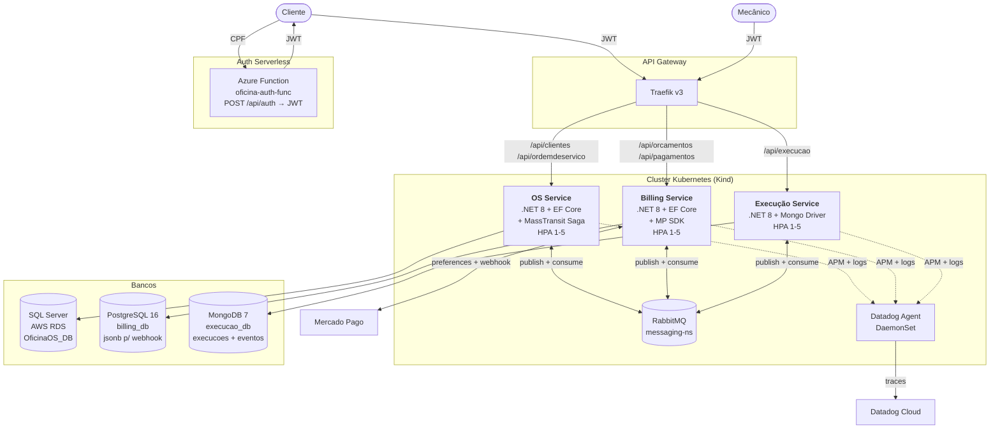
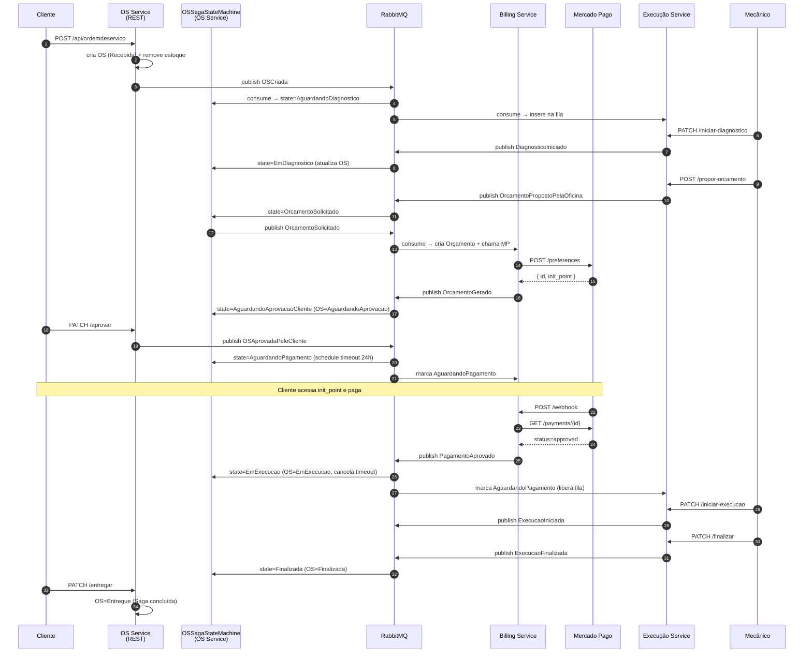

# Arquitetura — Fase 4 (Microsserviços + Saga)

## Visão Geral



## Saga Orquestrada — Fluxo Feliz



## Compensações da Saga

| Evento de falha | Estado atual | Compensação |
|---|---|---|
| `OrcamentoFalhou` | OrcamentoSolicitado | Saga finaliza com falha; OS continua em `AguardandoAprovacao` (manual) |
| `OSReprovadaPeloCliente` | AguardandoAprovacaoCliente | Estorna estoque local (OS), cancela orçamento (Billing), remove da fila (Execução), Saga finaliza |
| `PagamentoRecusado` | AguardandoPagamento | Volta para `AguardandoAprovacaoCliente`, cliente pode tentar novo método |
| Timeout 24h sem pagamento | AguardandoPagamento | Saga publica `OSCancelada` → todos os serviços marcam como removida |

## Estratégia de Saga — Justificativa

**Escolha: Orquestração Centralizada** no OS Service.

**Por quê não coreografia?**
- A coreografia distribui o conhecimento do fluxo entre todos os serviços — debug fica difícil quando algo trava.
- Para apresentação no vídeo de 15min, ter um endpoint `GET /api/sagas/{osId}` que retorna o estado completo é uma vantagem clara.
- A coreografia exigiria que cada serviço soubesse a próxima transição, o que aumenta o acoplamento implícito.

**Por quê não saga distribuída com múltiplos orquestradores?**
- Para 3 micros, o custo de operar múltiplos orquestradores supera o ganho.

**Implementação:** MassTransit `MassTransitStateMachine<SagaOS>` com state persistido via `EntityFrameworkRepository` no SQL Server do OS Service. `Schedule.Delay(24h)` agenda o timeout do pagamento. Compensações são `.ThenAsync(...)` que invocam `IOrdemDeServicoRepository`/`IPecaRepository` para estornar estoque.

## Comunicação entre Microsserviços

| Tipo | Quando | Exemplos |
|---|---|---|
| **REST síncrono externo** | Cliente/Mecânico → API | `POST /api/ordemdeservico`, `PATCH /api/execucao/{id}/finalizar` |
| **Mensageria assíncrona** | Micro → Micro (sempre) | `OSCriada`, `OrcamentoGerado`, `PagamentoAprovado`, `ExecucaoFinalizada` |
| **REST síncrono interno** | NÃO USADO | Decisão de evitar acoplamento síncrono entre micros — todos os payloads viajam denormalizados nos eventos |

**Princípio:** nenhum microsserviço acessa diretamente o banco de outro (regra destacada em amarelo no PDF da Fase 4).

## Modelo Relacional / Documental por Microsserviço

### OS Service — SQL Server
```
Clientes (Id PK, Nome, Cpf UQ, Email, Telefone)
Veiculos (Id PK, Placa UQ, Marca, Modelo, Ano, ClienteId FK)
Pecas (Id PK, Descricao, PrecoVenda, QuantidadeEstoque)
Servicos (Id PK, Descricao, Preco, TempoEstimadoHoras)
OrdensDeServico (Id PK, ClienteId FK, VeiculoId FK, Status, ValorOrcamento, datas...)
ItensPeca (Id PK, OrdemDeServicoId FK, PecaId, DescricaoPeca, Quantidade, PrecoUnitarioCobrado)
ItensServico (Id PK, OrdemDeServicoId FK, ServicoId, DescricaoServico, PrecoCobrado)
SagasOS (CorrelationId PK, OrdemDeServicoId UQ, CurrentState, Version concurrency token, ...)
+ tabelas InboxState/OutboxMessage/OutboxState (MassTransit)
```

### Billing Service — PostgreSQL
```
orcamentos (Id PK, CorrelationId UQ, OrdemDeServicoId IX, ClienteId, ValorTotal, Status, MercadoPagoPreferenceId, ...)
itens_orcamento (Id PK, OrcamentoId FK, Tipo, ItemId, Descricao, Quantidade, PrecoUnitario)
pagamentos (Id PK, OrcamentoId IX, OrdemDeServicoId IX, MercadoPagoPaymentId UQ, Status, ValorPago, WebhookPayloadJson jsonb, ...)
+ tabelas Inbox/Outbox (MassTransit)
```

### Execução Service — MongoDB
```
execucoes (collection)
  - { _id, CorrelationId UQ, OrdemDeServicoId UQ, ClienteId, VeiculoId, Dados { ... }, Status, MecanicoResponsavel, datas..., ValorOrcamentoProposto, ItensPropostos[] }
  - índices: ix_execucoes_osid (unique), ix_execucoes_status, ix_execucoes_correlation (unique)

eventos_execucao (collection)
  - { _id, CorrelationId, OrdemDeServicoId, Tipo, Descricao, MecanicoResponsavel, Payload (BsonDocument flexível), OcorreuEm }
  - índices: ix_eventos_os_tempo (OrdemDeServicoId + OcorreuEm)
```

## Observabilidade Reaproveitada da Fase 3

| Componente | Origem | Reuso na Fase 4 |
|---|---|---|
| **Datadog Agent** | DaemonSet K8s (Fase 3) | Coleta APM + logs dos 3 micros automaticamente |
| **CLR Profiler** | Dockerfile (Fase 3) | Replicado nos 3 Dockerfiles novos — auto-instrumentação sem código |
| **Serilog JSON** | Configurado na Fase 3 | Aplicado em cada Program.cs novo, com `dd_trace_id` injetado |
| **Health Checks** | Pattern Fase 3 | `/health` e `/health/detail` em cada micro (DB + RabbitMQ) |
| **Dashboard + 5 Alertas** | Configurado na Fase 3 | Será expandido com 1 painel por micro + 1 painel para Saga + traces distribuídos |

Traces distribuídos funcionam automaticamente: MassTransit injeta o W3C `traceparent` no header AMQP, e o CLR Profiler do Datadog correlaciona entre os 3 serviços. O resultado é uma visão de "uma OS atravessando 3 serviços" em uma única linha do Datadog APM.
